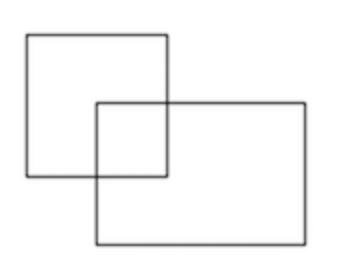

# Week3 Quiz: Detection algorithms

1. You are building a 3-class object classification and localization algorithm. The classes are: pedestrian (c=1), car (c=2), motorcycle (c=3). What would be the label for the following image? Recall y=[pc,bx,by,bh,bw,c1,c2,c3]
     
   - [x] y=[1,0.3,0.7,0.3,0.3,0,1,0]
   - [ ] y=[1,0.7,0.5,0.3,0.3,0,1,0]
   - [ ] y=[1,0.3,0.7,0.5,0.5,0,1,0]
   - [ ] y=[1,0.3,0.7,0.5,0.5,1,0,0]
   - [ ] y=[0,0.2,0.4,0.5,0.5,0,1,0]
   
2. Continuing from the previous problem, what should y be for the image below? Remember that “?” means “don’t care”, which means that the neural network loss function won’t care what the neural network gives for that component of the output. As before, y=[pc,bx,by,bh,bw,c1,c2,c3].
     
   - [ ] y=[1,?,?,?,?,0,0,0]
   - [x] y=[0,?,?,?,?,?,?,?]
   - [ ] y=[?,?,?,?,?,?,?,?]
   - [ ] y=[0,?,?,?,?,0,0,0]
   - [ ] y=[1,?,?,?,?,?,?,?]
   
3. You are working on a factory automation task. Your system will see a can of soft-drink coming down a conveyor belt, and you want it to take a picture and decide whether (i) there is a soft-drink can in the image, and if so (ii) its bounding box. Since the soft-drink can is round, the bounding box is always square, and the soft drink can always appears as the same size in the image. There is at most one soft drink can in each image. Here’re some typical images in your training set:
     
   - [ ] Logistic unit (for classifying if there is a soft-drink can in the image)
   - [x] Logistic unit, bx and by
   - [ ] Logistic unit, bx, by, bh (since bw = bh)
   - [ ] Logistic unit, bx, by, bh, bw
   
4. If you build a neural network that inputs a picture of a person’s face and outputs N landmarks on the face (assume the input image always contains exactly one face), how many output units will the network have?
   - [ ] N
   - [x] 2N
   - [ ] 3N
   - [ ] N**2

5. When training one of the object detection systems described in lecture, you need a training set that contains many pictures of the object(s) you wish to detect. However, bounding boxes do not need to be provided in the training set, since the algorithm can learn to detect the objects by itself.
   - [ ] True
   - [x] False

6. Suppose you are applying a sliding windows classifier (non-convolutional implementation). Increasing the stride would tend to increase accuracy, but decrease computational cost.
   - [ ] True
   - [x] False

7. In the YOLO algorithm, at training time, only one cell ---the one containing the center/midpoint of an object--- is responsible for detecting this object.
   - [x] True 
   - [ ] False
   
8. What is the IoU between these two boxes? The upper-left box is 2x2, and the lower-right box is 2x3. The overlapping region is 1x1.
   
   - [ ] 1/6
   - [x] 1/9
   - [ ] 1/10
   - [ ] None of the above
   
9. Suppose you run non-max suppression on the predicted boxes above. The parameters you use for non-max suppression are that boxes with probability ≤ 0.4 are discarded, and the IoU threshold for deciding if two boxes overlap is 0.5. How many boxes will remain after non-max suppression?
     
   - [ ] 3
   - [ ] 4
   - [x] 5
   - [ ] 6
   - [ ] 7
10. Suppose you are using YOLO on a 19x19 grid, on a detection problem with 20 classes, and with 5 anchor boxes. During training, for each image you will need to construct an output volume y as the target value for the neural network; this corresponds to the last layer of the neural network. (y may include some “?”, or “don’t cares”). What is the dimension of this output volume?
      - [ ] 19x19x(25x20)
      - [ ] 19x19x(20x25)
      - [x] 19x19x(5x25)
      - [ ] 19x19x(5x20)
